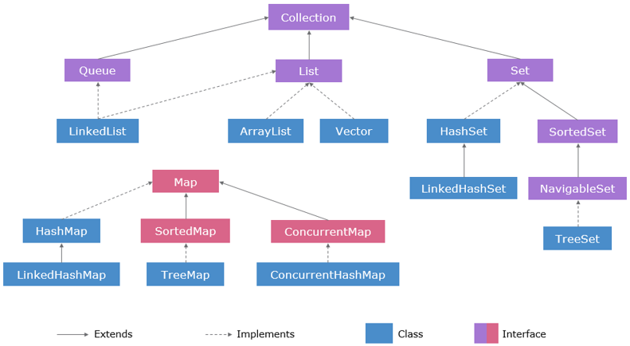
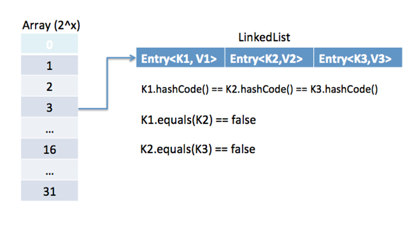
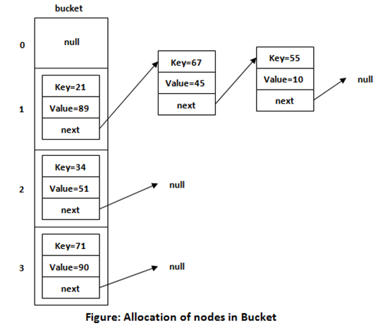

<h1 align="center">
  Collections Framework Conceptual Questions
</h1>


## Q1. What is a generic type parameter?
Generics means parameterized types. The idea is to allow a type (pre-defined as well as user-defined types) to be a parameter to methods, classes, and interfaces. Using Generics, it is possible to create classes that work with different data types. An entity such as a class, an interface, or a method that operates on a parameterized type is a generic entity.

For example, consider the following class definition.

```

class Calculator<T> {
    // An object of type T is declared
    T obj;
    Calculator(T obj) {	// constructor
    	this.obj = obj; 
    }
    public T getObject() { 
    	return this.obj; 
    }
}

```

When we implement Calculator, we can provide the type that we want it to take as an argument as shown below.

```

Calculator<String> obj1 = new Calculator<String>("Lets practice Java");

```

```

Calculator<Integer> obj1 = new Calculator<Integer>(1001);

```


## Q2. What are the advantages of using generic types?
Programs that use Generics has got many benefits over non-generic code.
- Code Reuse: We can write a method/class/interface once and use it for any type we want.
- Type Safety: Generics make errors to appear at compile time than at run time (It’s always better to know problems in your code at compile time rather than making your code fail at run time). Suppose you want to create an ArrayList that store name of students, and if by mistake the programmer adds an integer object instead of a string, the compiler allows it. But, when we retrieve this data from ArrayList, it causes problems at runtime.

```

// Creatinga an ArrayList without any type specified
ArrayList list = new ArrayList();
list.add("Java");
list.add("Scala");
list.add(101); // No compilation error
 
String s1 = (String)list.get(0);
String s2 = (String)list.get(2); // Causes ClassCastException at runtime

```

This can be resolved by using Generics at the time of ArrayList  creation.

```

// Creatinga an ArrayList with the type specified as String
ArrayList<String> list = new ArrayList<>();
list.add("Java");
list.add("Scala");
list.add(101); // Compilation error

```

## Q3. What Is Type Erasure?
Type erasure can be explained as the process of enforcing type constraints only at compile time and discarding the element type information at runtime. In other words, the generic type information is only available to the compiler, not the JVM.

Consider the given code.

```

public class StackImpl<E> {
    private E[] content;
    public StackImpl(int capacity) {
        this.content = (E[]) new Object[capacity];
    }
    public void push(E data) {
        // ..
    }
    public E pop() {
        // ..
    }
}

```

Upon compilation, the compiler replaces the unbound type parameter E with Object, ensuring type safety of the code and preventing runtime errors.

```

public class StackImpl {
    private Object[] content;
    public StackImpl(int capacity) {
        this.content = (Object[]) new Object[capacity];
    }
    public void push(Object data) {
        // ..
    }
    public Object pop() {
        // ..
    }
}

```


## Q4. What is the Collection framework?
- The Collection Framework in Java is a unified architecture that provides a set of interfaces, implementations, and algorithms to handle collections of objects. 
- Collections are groups of objects, such as lists, sets, and maps, which are stored and manipulated as a single unit.
- The Collection Framework provides a standard way to work with collections, making it easy for developers to write code that is reusable, type-safe, and efficient.
- The Collection Framework includes several key interfaces, such as Collection, List, Set, and Map. 
- It also includes a variety of implementation classes, such as ArrayList, HashSet, and TreeMap, which provide concrete implementations of these interfaces.
- Overall, the Collection Framework in Java provides a powerful and flexible way to work with collections of objects, making it easier for developers to write efficient, reusable, and scalable code.


## Q5. What is the hierarchy of the Collection Framework in Java?
- The Collection Framework in Java provides a hierarchy of interfaces and classes for managing and manipulating groups of objects. The java.util package contains all the classes and interfaces for the Collection framework.
- The Iterable interface represents any collection that can be iterated using the for-each loop. The Collection interface inherits from Iterable and adds generic methods for checking if an element is in a collection, adding and removing elements from the collection, determining its size etc.
- The List, Set, and Queue interfaces inherit from the Collection interface.
  - **List** is an ordered collection, and its elements can be accessed by their index in the list.
  - **Set** is an unordered collection with distinct elements, similar to the mathematical notion of a set.
  - **Queue** is a collection with additional methods for adding, removing and examining elements, useful for holding elements prior to processing.
  - **Map** interface is also a part of the collection framework, yet it does not extend Collection. This is by design, to stress the difference between collections and mappings which are hard to gather under a common abstraction. The Map interface represents a key-value data structure with unique keys and no more than one value for each key.

    
  


## Q6. What are the differences between ArrayList and LinkedList in Java?
| ArrayList | LinkedList |
|-----------|------------|
| This class uses a dynamic array to store the elements in it. With the introduction of generics, it supports the storage of all types of objects. | This class uses a doubly linked list to store the elements in it. Similar to the ArrayList, this class also supports the storage of all types of objects. |
| Manipulating ArrayList takes more time due to the internal implementation. Whenever we remove an element, internally the array is traversed, and the memory bits are shifted. | Manipulating LinkedList takes less time compared to ArrayList because there is no concept of shifting the memory bits in a doubly linked list. The list is traversed, and the reference link is changed. |
| Inefficient memory utilization. | Good memory utilization. |
| It can be one, two or multi-dimensional. | It can either be a single, double or circular LinkedList. |
| Insertion operation is slow. | Insertion operation is fast. |


## Q7. What is a HashMap?
In Java, HashMap is a class is found in java.util package. It provides the basic implementation of the Map interface of Java. HashMap in Java stores the data in (Key, Value) pairs, with the key being unique. One object is used as a key (index) to another object (value). If you try to insert the duplicate key in HashMap, it will replace the element of the corresponding key. 

HashMap in Java is similar to the HashTable class, but it is not synchronized. It allows us to store the null elements as well, but there should be only one null key. Moreover, there is no guarantee to the order of the map.

The below example shows how key value pairs are stored and retrieved in a HashMap.

```

import java.util.HashMap; 
public class HashMapExample { 
	public static void main(String[] args) { 
		HashMap<String, Integer> myMap = new HashMap<>(); // Add     
        myMap.put("Alice", 25);
        myMap.put("Bob", 30);
        myMap.put("Charlie", 35); 
        System.out.println(myMap.get("Alice")); // Output:           
        System.out.println(myMap.get("Bob")); // Output: 30 // Iterate over the keys a                       
        for (String key : myMap.keySet()) { 
        	System.out.println(key + ": " + myMap.get(key)); 
		}
 	}
 }

 ```


## Q8. Describe the various implementations of the Map interface and their use case differences.
- One of the most often used implementations of the Map interface is the HashMap. It is a typical hash map data structure that allows accessing elements in constant time, or O(1), but does not preserve order and is not thread-safe.
- To preserve the insertion order of elements, you can use the **LinkedHashMap** class which extends the HashMap and additionally ties the elements into a linked list, with foreseeable overhead.
- The **TreeMap** class stores its elements in a red-black tree structure, which allows accessing elements in logarithmic time, or O(log(n)). It is slower than the HashMap for most cases, but it allows keeping the elements in order according to some comparators.
- The **ConcurrentHashMap** is a thread-safe implementation of a hash map. It provides full concurrency of retrievals (as the get operation does not entail locking) and high expected concurrency of updates.
- The Hashtable class has been in Java since version 1.0. It is not deprecated but is mostly considered obsolete. It is a thread-safe hash map, but unlike ConcurrentHashMap, all its methods are simply synchronized, which means that all operations on this map block, even retrieval of independent values.


## Q9. What is the difference between HashSet and TreeSet?
Both HashSet and TreeSet classes implement the Set interface and represent sets of distinct elements. Additionally, TreeSet implements the NavigableSet interface. This interface defines methods that take advantage of the ordering of elements.

HashSet is internally based on a HashMap, and TreeSet is backed by a TreeMap instance, which defines their properties: HashSet does not keep elements in any particular order. Iteration over the elements in a HashSet produces them in a shuffled order. TreeSet, on the other hand, produces elements in order according to some predefined Comparator.


## Q10. What is an Iterator?
Iterator in Java is an interface used with the Collection framework to retrieve elements one by one. The Java Iterator is also known as the universal cursor of Java as it is appropriate for all the classes of the Collection framework. By using Iterator, we can perform both read and remove operations. It is an improved version of Enumeration with the additional functionality of removing an element.

It contains a total of four methods that are:

- **hasNext()** - It returns true if there are more elements left in the iteration. If there are no more elements left, then it will return false.
- **next()** - It is similar to hasNext() method and returns the next element in the traversal. If the iteration or collection of objects has no more elements left to iterate, then it throws the NoSuchElementException.
- **remove()** - The main function of this method is to remove the last element returned by the iterator traversing through the underlying collection.
- **forEachRemaining()** - This method accepts a Consumer instance as argument and performs the operation on all of the left components of the collection until all the components are consumed, or the action throws an exception. 


The below code uses an iterator to traverse the elements of an ArrayList.

```

import java.util.ArrayList;
import java.util.Iterator;
public class ExampleIterator {
    public static void main(String[] args) {
        ArrayList<String> list = new ArrayList<String>();
        list.add("apple");
        list.add("banana");
        list.add("orange");
        // Get an iterator for the ArrayList
        Iterator<String> iterator = list.iterator();
        // Traverse the elements using the iterator
        while (iterator.hasNext()) {
            String element = iterator.next();
            System.out.println(element);
        }
  }
}

```


## Q11. Differentiate between Iterator and ListIterator.
| Iterator | ListIterator |
|----------|--------------|
| Can traverse elements present in Collection only in the forward direction.| Can traverse elements present in Collection both in forward and backward directions. |
| Helps to traverse all collections. | Can only traverse List and not the other two. |
| Indexes cannot be obtained by using Iterator. | It has methods like nextIndex() and previousIndex() to obtain indexes of elements at any time while traversing List. |
| Cannot modify or replace elements present in Collection. | We can modify or replace elements with the help of set(E e). |
| Trying to add elements throws ConcurrentModificationException. | Can easily add elements to a List at any time. |
| Certain methods of Iterator are next(), remove() and hasNext(). | Certain methods of ListIterator are next(), previous(), hasNext(), hasPrevious(), add(E e). |


## Q12. What happens when we implement the hashcode() method for an object and put those objects into Set or HashMap?
#### HashMap:
- When a key-value pair is added to the HashMap, the hashCode method of the key object is called to generate a hash code for determining the index of the array in which the key-value pair will be stored.
- If there is already an entry at the index, the equals method of the key object is called to determine if the key already exists in the map. If the key already exists, the value is updated; else, a new key-value pair is added to the map.
- When we retrieve a value from a HashMap using a key, the hashCode method of the key is called again to determine the index of the array where the key-value pair is stored. The equals method of the key is then used to determine if the key exists in the map and return the associated value.
- Therefore, If we implement hashCode method, it is important that this method of the key object is implemented properly so that it generates unique hash codes for each key. This helps to minimize collisions, which occur when two different keys generate the same hash code and are stored in the same index in the array.​

#### Set:
- When an element is added to the Set, the hashCode method is called to generate a hash code for determining in which "bucket" the element should be placed. If an element with the same hash code already exists in the bucket, the equals() method is called to determine if the new element is equal to the existing one. If the new element is not equal, it will be added to the bucket; else, the element is not added.
- When we retrieve an element from a set, the hashCode method is called again to determine the bucket where the element is stored. The equals method of the element is then called to determine if it is equal to the element being searched for. If an equal element is found, it is returned
- Therefore, if we implement the hashCode method, it is important that this method of objects in the set is implemented properly so that it generates unique hash codes for each element which helps to minimize collisions and data missing.


## Q13. Explain the difference between Queue and Deque.
| Queue | Dequeue |
|-------|---------|
| A queue is a linear data structure that stores a collection of elements, with operations to enqueue (add) elements at the back of the queue, and dequeue (remove) elements from the front of the queue. | A deque (double-ended queue) is a linear data structure that stores a collection of elements, with operations to add and remove elements from both ends of the deque. |
| Elements can only be inserted at the end of the data structure. | Elements can be inserted from both ends of the data structure. |
| Elements can only be removed from the front of the data structure. | Elements can be removed from both ends of the data structure. |
| Queues are a specialized data structure that uses the FIFO approach i.e., First In First Out. | Deque can be used to implement the functionalities of both Stack (LIFO approach i.e., Last In First Out) and Queue (FIFO approach i.e., First In First Out). | 
| A queue can be implemented using Array or Linked List. | Deque can be implemented using Circular Array or Doubly Linked List. |
| Queues can be used as a building block for implementing more complex data structures, such as priority queues or stacks. | Deques can be used as a building block for implementing more complex data structures, such as double-ended priority queues or circular buffers. |
| Common queue operations include enqueue, dequeue, peek (return the front element without removing it), and size (return the number of elements in the queue). | Common deque operations include addFirst (add an element to the front of the deque), addLast (add an element to the back of the deque), removeFirst (remove the first element from the deque), removeLast (remove the last element from the deque), peekFirst (return the first element without removing it), and peekLast (return the last element without removing it). |
| Queue elements cannot be accessed with the help of an iterator. | Deque can be traversed using iterator. |
| Examples of queue-based algorithms include Breadth-First Search (BFS) and printing a binary tree level-by-level. | Examples of deque-based algorithms include sliding window problems and maintaining a maximum or minimum value in a sliding window. |


## Q14. What is the Comparator interface?
Java 8 Comparator interface is a functional interface that contains only one abstract method compare(). It can be used as the assignment target for a lambda expression or method reference.

The below code uses the Comparator interface to define a custom order for String objects.

```

public class ExampleComparator {
    public static void main(String[] args) {
        ArrayList<String> list = new ArrayList<String>();
        list.add("banana");
        list.add("apple");
        list.add("orange");
        // Sort the list using a Comparator that sorts in reverse alphabetical order
        Comparator<String> reverseComparator = new Comparator<String>() {
            public int compare(String s1, String s2) {
                return s2.compareTo(s1);
            }
        };
        Collections.sort(list, reverseComparator);
        System.out.println(list);
  }
}

```


## Q15. What is the Comparable Interface?
In Java, the Comparable interface is used to define a natural ordering for the objects of a class. The Comparable interface is part of the java.lang package and has a single method called compareTo() that is used to compare two objects.

The below code uses the Comparable interface to define a natural ordering for Person objects.

```

public class Person implements Comparable<Person> {
    private String name;
    private int age;
    public Person(String name, int age) {
        this.name = name;
        this.age = age;    
    }
	public int compareTo(Person other) {
        // Compare the age of the two persons
        return Integer.compare(age, other.getAge());
    }
}
public class ExampleComparable {
    public static void main(String[] args) {
        ArrayList<Person> list = new ArrayList<Person>();
        list.add(new Person("Alice", 25));
        list.add(new Person("Bob", 20));
        list.add(new Person("Charlie", 30));
        // Sort the list using the natural ordering defined by the Person class
        Collections.sort(list);
        System.out.println(list);
    }
}

```

## Q16. What is the difference between Comparator and Comparable interfaces in Java?
Comparable and Comparator both are interfaces and can be used to sort collection elements.

However, there are a few differences between Comparable and Comparator interfaces are given below.

| Comparable | Comparator |
|------------|------------|
| Comparable provides a single sorting sequence. In other words, we can sort the collection on the basis of a single element such as id, name, and price. | The Comparator provides multiple sorting sequences. In other words, we can sort the collection on the basis of multiple elements such as id, name, and price etc. |
| Comparable affects the original class, i.e., the actual class is modified. | Comparator doesn't affect the original class, i.e., the actual class is not modified. |
| Comparable provides compareTo() method to sort elements. | Comparator provides compare() method to sort elements. |
| Comparable is present in java.lang package. | A Comparator is present in the java.util package. | 
| We can sort the list elements of Comparable type by Collections.sort(List) method. | We can sort the list elements of Comparator type by Collections.sort(List, Comparator) method. | 


## Q17. What are the characteristics of ArrayList in Java?
The important features of the Java ArrayList class are:
- It can contain duplicate elements.
- It can contain any number of null elements.
- It maintains insertion order.
- It is non-synchronized.
- It allows random access because the array works on an index basis (index number in the range 0 to size -1).
- Its manipulation is a little bit slower than the LinkedList in Java because a lot of shifting needs to occur if any element is removed from the array list.
- We cannot create an ArrayList of the primitive types, such as int, float, char, etc., a wrapper class is required in such cases.
- Java ArrayList gets initialized by the size, but the size is dynamic - varies according to the elements getting added or removed from the list.

Here is a complete Example:

```

import java.util.ArrayList;
public class ArrayListCharacteristics {
	public static void main(String[] args) {
		System.out.println("Resizable Array:");
		ArrayList<String> fruits = new ArrayList<>();
		fruits.add("Apple");
		fruits.add("Banana");
		fruits.add("Orange");
		System.out.println(fruits);
		System.out.println("\nOrdered Collection:");
		fruits.add(1, "Mango"); 
		System.out.println(fruits);  
		System.out.println("\nAllows Duplicates:");
		fruits.add("Banana");
		System.out.println(fruits); 
		System.out.println("\nRandom Access:");
		String firstFruit = fruits.get(0);
		System.out.println("First Fruit: " + firstFruit); 
	}
}

```

**Output:**

Resizable Array:
[Apple, Banana, Orange]

Ordered Collection:
[Apple, Mango, Banana, Orange]

Allows Duplicates:
[Apple, Mango, Banana, Orange, Banana]

Random Access:
First Fruit: Apple


## Q18. Mention the important methods of Queue.
A Queue is a collection designed for holding elements prior to processing in FIFO(First In First Out) order. Besides basic Collection operations, queues provide additional insertion, extraction, and inspection operations. Each of these methods exists in two forms: one throws an exception if the operation fails, and the other returns a special value (either null or false, depending on the operation).

#### Summary of Queue Methods:

<div align="center">
  
|  | Throws exception | Returns special value |
|--|------------------|-----------------------|
| **Insert** | add(e) | offer(e) |
| **Remove** | remove() | poll() |
| **Examine** | element() | peek() |

</div>

- boolean add(E e) - Inserts the specified element into this queue if it is possible to do so immediately without violating capacity restrictions, returning true upon success and throwing an IllegalStateException if no space is currently available.
- E element() - Retrieves, but does not remove, the head of this queue.
- boolean offer(E e) - Inserts the specified element into this queue if it is possible to do so immediately without violating capacity restrictions.
- E peek() - Retrieves, but does not remove, the head of this queue, or returns null if this queue is empty.
- E poll() - Retrieves and removes the head of this queue or returns null if this queue is empty.
- E remove() - Retrieves and removes the head of this queue.


Here is a complete example:

```

public class QueueExample {
	public static void main(String[] args) {
		// Create a Queue using LinkedList implementation
		Queue<String> tasks = new LinkedList<>();
		// Add elements to the queue (Enqueue)
		tasks.offer("Task 1");
		tasks.add("Task 2"); // Throws an exception if queue is full (rare with LinkedList)
		tasks.offer("Task 3");
		// Check the size of the queue
		System.out.println("Number of tasks: " + tasks.size());
		// Check if the queue is empty
		System.out.println("Is queue empty: " + tasks.isEmpty());
		// Peek at the head element without removing it
		System.out.println("Next task (peek): " + tasks.peek());
		// Remove and return the head element (Dequeue)
		System.out.println("Processing task: " + tasks.poll());
		// Iterate through the queue elements (not recommended for modification)
		for (String task : tasks) {
			System.out.println("Task in queue: " + task);
		}
	}
}

```

**Output:**

Number of tasks: 3<br>
Is queue empty: false <br>
Next task (peek): Task 1<br>
Processing task: Task 1<br>
Task in queue: Task 2<br>
Task in queue: Task 3


## Q19. Which object is popular as the HashMap key and why?
The **String** is the popular HashMap key.  This is because String is immutable in Java. So, the hashcode of the String is cached every time it is created and doesn't need to be calculated again. This makes the processing faster than other HashMap keys. 


## Q20. How does HashMap work?
Working of HashMap:
- Java HashMap is a Hash table-based implementation. HashMap in Java extends the Abstract Map class that implements the Map interface.
- HashMap in Java uses its inner class Node<K, V> for storing mappings. HashMap works on a hashing algorithm and uses the hashCode() and equals() method on the key for get() and put() operations. 
- HashMap uses a singly linked list to store elements, these are called bins or buckets. 
- When we call the put() method, the key's hash code determines the bucket that will be used to store the mapping.
  - Once the bucket is identified, hashCode is used to check if there is already a key with the same hashCode. 
  - If there is an existing key with the same hashCode, then the equals() method is used on the key. If equals() returns true, then the value is overwritten, otherwise, a new mapping is made to this singly linked list bucket. 
  - If there is no key with the same hashCode then the mapping is inserted into the bucket. 
- For the HashMap get() operation, again key hashCode is used to determine the bucket to look for the value. 
  - After the bucket is identified, entries are traversed to find out the Entry using the hashCode() and equals() method.
  - If a match is found, the value is returned otherwise null is returned. 

The below images show the explanation of get and put operations.
<div align="center">
  
  
  

</div>


**Example:**

```

public static void main(String[] args) throws IOException {
		Map<String, String> map = new HashMap<>();
		map.put("1", "One"); // put example
		map.put("2", "Two");
		map.put("3", "Three");
		map.put("4", null); // null value
		map.put(null, "100"); // null key
		String value = map.get("3"); // get example
		System.out.println("Key = 3, Value = " + value);
		System.out.println(map);
	}

```

**Output:**

Key = 3, Value = Three<br>
{null=100, 1=One, 2=Two, 3=Three, 4=null}


## Q21. Difference between Hashmap and Hash Table.
| Hashmap | Hashtable |
|---------|-----------|
| Methods are not synchronized.| Every method is synchronized. |
| Multiple threads can operate simultaneously and hence hashmap’s object is not thread-safe. | At a time only one thread is allowed to operate the Hashtable’s object. Hence it is thread-safe. |
| Threads are not required to wait and hence relatively performance is high. | It increases the waiting time of the thread and hence performance is low.
| Null is allowed for both key and value. | Null is allowed for neither key nor value. Otherwise, we will get a null pointer exception. |
| It is introduced in the 1.2 version. | It is introduced in the 1.0 version. |
| It is non-legacy. | It is a legacy. |

##### Example:

```

import java.util.HashMap;
import java.util.Hashtable;
import java.util.Map;
public class MainClass {
	public static void main(String args[]) {
		// ----------------hashmap--------------------------------
		HashMap<Integer, String> hm = new HashMap<Integer, String>();
		hm.put(100, "Amit");
		hm.put(104, "Amit");
		hm.put(101, "Vijay");
		hm.put(102, "Rahul");
		hm.put(null, "Sachin");// Allowed
		hm.put(103, null);// Allowed
		System.out.println("-----------Hash map-----------");
		for (Map.Entry m : hm.entrySet()) {
			System.out.println(m.getKey() + " " + m.getValue());
		}
		// ----------hashtable -------------------------
		Hashtable<Integer, String> ht = new Hashtable<Integer, String>();
		ht.put(101, " ajay");
		ht.put(101, "Vijay");
		ht.put(102, "Ravi");
		ht.put(103, "Rahul");
		// ht.put(null, "Sachin");//Not allowed-NullPointerException is thrown
		// ht.put(103, null);//Not allowed-NullPointerException is thrown
		System.out.println("-------------Hash table--------------");
		for (Map.Entry m : ht.entrySet()) {
			System.out.println(m.getKey() + " " + m.getValue());
		}
	}
}

```

**Output:**
-----------Hash map-----------<br>
null Sachin<br>
100 Amit<br>
101 Vijay<br>
102 Rahul<br>
103 null<br>
104 Amit<br>
-------------Hash table--------------<br>
103 Rahul<br>
102 Ravi<br>
101 Vijay<br>


## Q22. Collections (ArrayList, List, HashMap)
- Collections are fundamental data structures in Java that organize and manage groups of objects.
- List: List is one of the interfaces provided by Collection framework in which the elements are in ordered and have a specific index (position). 
- ArrayList : It is class which implements the List interface in which elements are inserted and accessed based on their position (index).
- Lists allows the duplicate elements and elements can be added or removed dynamically.
- Example: ["Apples", "Bananas", "Oranges"]

**Example Code for ArrayList:**

```

public static void main(String[] args) {
        ArrayList<String> groceries = new ArrayList<>();
        groceries.add("Milk");
        groceries.add("Bread");
        groceries.add("Eggs");
        // Accessing elements by index
        System.out.println("First item: " + groceries.get(0));
        // Looping through the list
        for (String item : groceries) {
            System.out.println(item);
        }
    }
}

```


#### Hashmap:
- It is class which implements Map Interface in which it is used to handle unordered collections that store key-value pairs.
- Keys should be unique, and the elements are accessed using those keys.
- It uses hashing for fast access),
- Example: {"John": "9898989898", "Jane": "9876543210"}

##### Example for HashMap:

```

public class StudentGrades {
    public static void main(String[] args) {
        HashMap<String, Integer> grades = new HashMap<>();
        grades.put("Alice", 90);
        grades.put("Bob", 85);
        grades.put("Charlie", 95);
        // Accessing values by key
        System.out.println("Alice's grade: " + grades.get("Alice"));
        // Looping through key-value pairs
        for (String name : grades.keySet()) {
            System.out.println(name + ": " + grades.get(name));
        }
    }
}

```

## Q23. What are the differences between Vectors and Arrays.
| Feature | Array | Vector |
|---------|-------|--------|
| **Nature** | Fixed-size collection of elements of the same data type. | Dynamic-size collection that can grow or shrink, implements the List interface. |
| **Size** | modification	Cannot be resized once initialized. | Can grow or shrink dynamically as needed. |
| **Performance** | Generally faster as it is a simple data structure with direct access to its elements. | Slower than arrays due to the overhead of being a dynamic array and synchronized methods. |
| **Synchronization** | Not synchronized.	Synchronized. | All methods are synchronized, making it thread-safe but slower in single-threaded scenarios. |
| **Data Type** | Can hold primitives or objects. | Can only hold objects. |
| **Iteration** | Can use a simple for-loop or for-each loop. | Can use Iterator, ListIterator, Enumeration, for-loop, or for-each loop. | 
| **Utilities** | Does not have built-in methods for manipulation (e.g., adding or removing elements). | Provides methods for manipulation (e.g., add, remove, clear). |


## Q24. How do you convert ArrayList to Array and vice versa?
Converting ArrayList to Array:

- toArray() method:

The ArrayList class provides two versions of the toArray() method:

**toArray():** This method returns an array of type Object. It's useful when you don't know the specific type of elements in the ArrayList. However, you might need to cast the elements to their desired types later.

```

ArrayList<String> names = new ArrayList<>();
names.add("Alice");
names.add("Bob");
// Convert to Object array
Object[] namesArray = names.toArray();
// Accessing elements and potential casting
String firstElement = (String) namesArray[0];  // Casting required

```

**toArray(T[] a):** This method allows you to specify the target array type (T) and creates an array of that type. It's more type-safe and avoids casting issues. If the provided array is not large enough, a new array of the specified type will be created.

```

ArrayList<String> names = new ArrayList<>();
names.add("Alice");
names.add("Bob");
// Convert to String array
String[] namesArray = names.toArray(new String[names.size()]);
// Accessing elements directly (no casting required)
String firstElement = namesArray[0];

```

- Manual conversion (using loop):

We can iterate through the ArrayList and manually add elements to a new array you create. This approach gives more control over the array creation process.

```

ArrayList<Integer> numbers = new ArrayList<>();
numbers.add(1);
numbers.add(2);
numbers.add(3);
// Manual conversion
int[] numbersArray = new int[numbers.size()];
for (int i = 0; i < numbers.size(); i++) {
 numbersArray[i] = numbers.get(i);
}

```

#### Converting Array to ArrayList:
- Wrapper Class Constructor:

You can create a new ArrayList instance and use its constructor that takes a collection as an argument.

```

String[] namesArray = {"Alice", "Bob"};
// Convert to ArrayList
ArrayList<String> namesList = new ArrayList<>(Arrays.asList(namesArray));
// Accessing elements using ArrayList methods
String firstElement = namesList.get(0);

```

- Collections.addAll() method:

The Collections class provides a static method addAll(Collection<T> c, T[] elements) that adds all elements from an array to an existing ArrayList.

```

String[] namesArray = {"Alice", "Bob"};
ArrayList<String> namesList = new ArrayList<>();
// Convert to ArrayList
Collections.addAll(namesList, namesArray);
// Accessing elements using ArrayList methods
String firstElement = namesList.get(0);

```

## Q25. What are the Differences between Arraylist and Vector?
The key differences between ArrayList and Vector are:

|  | ArrayList | Vector |
|--|-----------|--------|
| Synchronization | Non-synchronized. This means multiple threads can access and modify an ArrayList concurrently, potentially leading to data inconsistencies if not handled properly. You'll need to implement your own synchronization mechanisms using techniques like synchronized blocks or concurrent collections from Java's java.util.concurrent package. | Synchronized. All methods of Vector are synchronized, making it thread-safe for concurrent access. However, this synchronization comes at a performance cost. |
| Performance | Generally faster due to its non-synchronized nature. Operations like adding, removing, or accessing elements are quicker without the overhead of synchronization. | Slower due to synchronization. Every method access involves acquiring a lock, which can introduce performance bottlenecks in multithreaded environments. |
| Memory Management | Increases its size by 50% of its current capacity when it needs more space to accommodate new elements. This can lead to some wasted memory if the increase is more than what is actually required. | Doubles its size (100% increase) when it reaches capacity. This can be more efficient in some cases but might also lead to memory waste if the growth pattern is unpredictable. |
| Legacy Status | Part of the core Java collections framework introduced in JDK 1.2. It's the recommended choice for most scenarios. | A legacy class introduced in earlier Java versions. While it's still functional, it's generally considered less favorable due to its synchronization overhead and lack of features compared to ArrayList. |
| When to use | ArrayList may be used for most collection needs unless thread safety is absolutely critical. | Consider Vector only if you specifically need a synchronized collection in legacy code and are aware of its performance implications. In modern Java development, it's recommended to explore thread-safe alternatives from the java.util.concurrent package for better performance and flexibility. |


## Q26. In which situation will you go for ArrayList and LinkedList?
The choice between ArrayList and LinkedList in Java depends on the specific operations you need to perform more frequently in your program.

#### Use ArrayList when:
- Random access is frequent: ArrayList provides efficient random access (getting or setting elements by index) using constant time complexity (O(1)). This is because elements are stored in a contiguous memory location, allowing direct access based on the index.
- Adding/removing elements at the end is common: Adding or removing elements at the end of the list is also relatively efficient in ArrayList with time complexity of O(1) (amortized) due to its dynamic resizing mechanism.

#### Use LinkedList when:
- Frequent insertions or deletions in the middle: LinkedList excels at inserting or removing elements in the middle of the list. These operations have a time complexity of O(1) (on average) as only the links between nodes need to be adjusted, not the underlying data movement.
- Memory usage is a major concern: For scenarios where memory efficiency is critical, LinkedList can be a better choice. It avoids the overhead of contiguous memory allocation like ArrayList. However, each element in a LinkedList has an overhead of storing a reference to the next element, which can be a factor in some cases.

#### Additional Considerations:
- Iterating over the entire list: Both ArrayList and LinkedList can be used for iterating over elements. However, if you only need to iterate without modification, ArrayList might be slightly faster due to its simpler structure.
- Searching for specific elements: If you frequently search for elements by value, ArrayList might be preferable due to faster random access.


## Q27. Why are HashMaps faster? Why do we prefer them?
HashMaps are generally faster than alternatives like arrays in Java for several reasons:

- **Average-case Constant Time Access:** HashMaps use hashing to locate elements. This allows for an average-case time complexity of O(1) for insertion, deletion, and retrieval. Arrays, on the other hand, require shifting elements for insertions and deletions, leading to O(n) complexity in the worst case.
- **Dynamic Sizing:** HashMaps automatically adjust their size as needed, eliminating the need to pre-define the size like with arrays. This is particularly beneficial when the number of elements is unknown beforehand or can vary significantly.
- **No Need for Manual Indexing:** You don't need to know the exact index of an element to access it in a HashMap. You simply provide the key, and the hashing mechanism efficiently locates the element. This simplifies code and reduces the risk of errors caused by incorrect indexing.
- **Object-Oriented Design:** HashMaps align well with object-oriented programming principles. They allow you to use custom objects as keys, providing greater flexibility and organization compared to arrays that can only hold primitive types or object references by index.

In summary, HashMaps offer:

- Faster average-case access times
- Dynamic sizing for efficient memory usage
- Simpler access using keys
- Better fit for object-oriented data structures

These advantages make HashMaps the preferred choice for many scenarios where you need a fast, flexible, and efficient way to store and retrieve key-value pairs.


## Q28. What is Collision in HashMap?
In HashMaps, a collision refers to a situation where two different keys calculate to the same hash code. This happens because the hash function used by HashMaps might not be perfect, and it's possible for unequal objects to have the same hash value.

#### Collision Scenario:
- Imagine you have a HashMap that stores key-value pairs.
- You try to add a new key-value pair to the HashMap.
- The HashMap calculates the hash code for the key using its built-in hash function.
- However, another key in the HashMap might already have the same hash code.

#### Collision Resolution Strategies:

- HashMaps in Java use a technique called chaining to resolve collisions. Here's how it works:
- When a collision occurs, the new key-value pair is not directly added to the location determined by the hash code.
- Instead, a linked list is used at that location. The new key-value pair is added to the beginning of this linked list.
- Any subsequent keys that collide with the same hash code are also added to the same linked list.

#### Impact of Collisions:

- Collisions can potentially slow down the performance of HashMaps, especially if there are many collisions. This is because searching for a specific key might involve traversing a linked list in the worst case.
- The ideal scenario is to minimize collisions by having a good hash function that distributes keys evenly across the HashMap's buckets (array of linked lists).


## Q29. What are the prerequisites for adding POJO class as a key in a HashMap?
Here are the prerequisites for adding a POJO (Plain Old Java Object) class as a key in a HashMap:

- equals() and hashCode() Override:
  
	Your POJO class needs to override the equals() and hashCode() methods from the Object class.

	- The equals() method should define how two objects of your class are considered equal. It should compare the relevant fields in your object that uniquely identify an instance.  
	- The hashCode() method should return a consistent hash code for an object based on its state in the equals() comparison. This ensures efficient retrieval from the HashMap using the key.

- Immutability (Optional but Recommended):
  
	It's highly recommended to make your POJO class immutable. This means the state (values of instance variables) cannot be changed after the object is created. Immutability helps maintain consistency in the hash code and avoid unexpected behavior in the HashMap. You can achieve immutability by:

	- Making instance variables private and final.
	- Providing a constructor to initialize all fields.
	- If necessary, create new instances with modified data instead of modifying existing ones.
