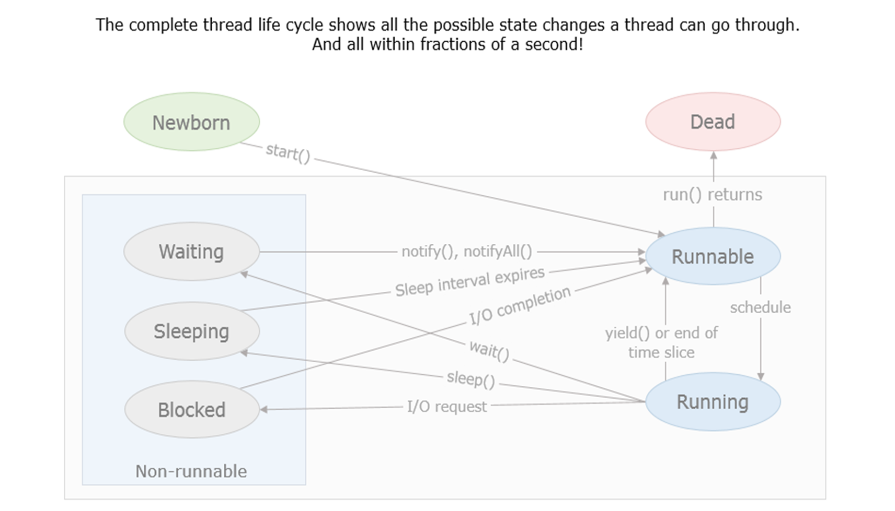
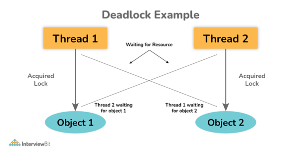

<h1 align="center">
  Multithreading and Concurrency Conceptual Questions
</h1>

## Q1. Explain the thread life cycle.
Whenever a thread is created to perform its task, it goes through different states between the time it is created and when it completes.
During its life cycle, a thread can move to the following different states:

- **New:** When a thread object is created, It is in a New state
- **Runnable:** The start() method brings the new thread to the runnable state
- **Running:** When the thread is scheduled and is being executed by the processor, it is in the running state
- **Non-Runnable:** If the thread is sleeping, waiting for a resource that is being used by another thread, or blocked because of an I/O request, it is in a Non-Runnable state
- **Dead:** When all the operations have been completed, The thread will terminate and go into the dead state



## Q2. How to create a thread in Java?
Thread creation can happen in two ways.

  - In the first way, A class extends the Thread Class of Java.lang package and overrides its run() method to define the operations that need to be performed by the thread, Creates instances of the subclass of the Thread, and start invoking the start() method. The start() method begins the thread's execution, after which the JVM invokes its run() method.

```

class UploadResult extends Thread {
@Override
  public void run() {
// Thread implementation
  }
}
 
class ThreadTester {
UploadResult uploadThread = new UploadResult();
  uploadThread.start();
}

```

  - The other way of creating threads is to implement the java.lang.Runnable interface and redefine the run() method to define the operations to be performed by the thread. Create instances of the Thread class by passing the instance of the class that implements the Runnable interface. Then, invoke the start() method on the instance that got created.

```

class UploadResult implements Runnable {
    @Override
    public void run() {
        // Thread implementation
    }
}
class Test {
    public static void main(String[] args) {
        UploadResult uploadRunnable = new UploadResult();
        Thread threadObj = new Thread(uploadRunnable);
        threadObj.start();
    }
}

```


## Q3. What is a Thread Pool?
- A thread pool is a group of pre-initialized worker threads that are available to perform a set of tasks. Rather than creating a new thread for each task, the thread pool allows for the efficient use and management of a fixed number of threads that are reused across multiple tasks.
- The thread pool manages a queue of tasks waiting to be executed and assigns them to available threads in the pool. Once a task has been completed, the thread is returned to the pool and made available to process additional tasks.
- Java provides built-in support for thread pools through the java.util.concurrent.Executor framework. The Executor framework includes several implementations of thread pools, including fixed-size, cached, and scheduled thread pools.


## Q4. Give some examples of thread-safe collection frameworks.
In Java, a thread-safe collection framework is a set of data structures that can be accessed and modified by multiple threads simultaneously without causing any issues like data corruption or inconsistency. Some examples of thread-safe collection frameworks in Java are: 

- Vector (parent is List) 
- Hashtable (parent is Map)

**Note:** The Collections class (as opposed to the Collection interface), provides static methods that operate on or return collections, which are known as Wrapper implementations.

         `static <T> Collection<T> synchronizedCollection (Collection<T> c):`
        Returns a synchronized (thread-safe) collection backed by the specified collection.

#### Concurrent Collections:
- **ConcurrentHashMap:** This is a thread-safe version of HashMap, which allows multiple threads to access and modify the map concurrently without any locking or blocking. 
- **CopyOnWriteArrayList:** This is a thread-safe version of ArrayList, which creates a new copy of the underlying array whenever an element is added, updated, or removed. This ensures that the original array remains unchanged, and multiple threads can iterate over the list concurrently without any issues.
- **ConcurrentLinkedQueue:** Multiple threads can add and remove elements from the queue concurrently, and the queue guarantees that the elements are processed in the order they were added.
- **BlockingQueue:** This is an interface that provides a thread-safe queue implementation that supports blocking operations. It allows a thread to wait until there is an element available for processing or until the queue has space to accept a new element.

ConcurrentSkipListMap: This is a thread-safe version of TreeMap, which provides a sorted map implementation that allows multiple threads to access and modify the map concurrently without any locking or blocking. 

## Q5. What is CompletableFuture?
- CompletableFuture is a Java class introduced in Java 8 as part of the Java Concurrency API. It is a feature that provides a way to perform asynchronous, non-blocking programming in Java.
- It is a powerful class that can be used for a variety of tasks such as making network requests, processing large amounts of data, or performing background operations in a user interface. It allows us to write code that is more efficient, responsive, and easier to read and maintain.
- It provides a wide range of methods for composing and combining asynchronous computations. It allows us to chain together a series of operations to be executed in sequence or in parallel and provides a range of methods to handle exceptions and timeouts.
- It is highly customizable and can be adapted to a wide range of use cases. It provides a rich set of methods for handling callbacks, cancellations, and timeouts, and can be used with any functional interface that takes no arguments and returns a value.

**Example:**

```

import java.util.concurrent.CompletableFuture; 
public class CompletableFutureExample { 
	public static void main(String[] args) throws Exception { 
		CompletableFuture<String> completableFuture =CompletableFuture.supplyAsync(() -> {
					 try { // simulate some long-running operation
							 Thread.sleep(2000); 
					} catch (InterruptedException e) {
						 throw new   IllegalStateException(e); 
					} 
					return "Result of the asynchronous computation"; }); 
                     System.out.println("The main thread continues to execute while the CompletableFuture is running...");it is available (blocking)
                    String result = completableFuture.get();
                    System.out.println("Result: " + result);
 } 
}

```

## Q6. What is volatile keyword?
- The volatile keyword is used to indicate that a variable's value may be modified by different threads at any given time. When a variable is declared as volatile, the compiler and the JVM ensure that all reads and writes to the variable are atomic, meaning that they are completed as a single, indivisible operation.
- This ensures that the variable's value is always up-to-date and visible to all threads and that changes made to it by one thread are immediately visible to other threads.
- Without the volatile keyword, different threads may have their own copies of the variable in their local memory, which may not reflect the latest changes made by other threads, resulting in race conditions, inconsistencies, and other synchronization problems.
- Therefore, the volatile keyword is typically used for shared variables that are accessed and modified by multiple threads, such as counters, flags, and status indicators.

Here is a complete Example:

```

public class VolatileExample {
	private static volatile boolean running = true;
	public static void main(String[] args) throws InterruptedException {
		Runnable r = () -> {
			int counter = 0;
			while (running) {
				counter++;
			}
			System.out.println("Thread stopped. Counter: " + counter);
		};
		Thread thread = new Thread(r);
		thread.start();
		Thread.sleep(1000);
		running = false; 
		thread.join();
	}
}
// Output: Thread stopped. Counter: 1116143332

```

## Q7. What do you understand about BlockingQueue?
BlockingQueue is a Java Queue that supports operations that wait for the queue to become non-empty when retrieving and removing an element, and wait for space to become available in the queue when adding an element.


## Q8. What do you understand by Race-condition?
A condition in which the critical section (a part of the program where shared memory is accessed) is concurrently executed by two or more threads. It leads to incorrect behavior of a program.


## Q9. What is the function of the yield method in a Thread class?
The yield() method in the Thread class in Java is called on the current Thread object to send the currently running thread back to the ready state.

Here is a complete Example:

```

public class YieldExample {
	public static void main(String[] args) {
		Thread thread1 = new Thread(() -> {
			for (int i = 0; i < 5; i++) {
				System.out.println("Thread 1: " + i);
				Thread.yield();
			}
		});
		Thread thread2 = new Thread(() -> {
			for (int i = 0; i < 5; i++) {
				System.out.println("Thread 2: " + i);
				Thread.yield();
			}
		});
		thread1.start();
		thread2.start();
	}
}

```

**Output:**

Thread 1: 0<br>
Thread 1: 1<br>
Thread 1: 2<br>
Thread 1: 3<br>
Thread 2: 0<br>
Thread 2: 1<br>
Thread 1: 4<br>
Thread 2: 2<br>
Thread 2: 3<br>
Thread 2: 4<br>


## Q10. What is ThreadScheduler in Java?
A component of Java that decides which thread to run or execute and which thread to wait for is called a thread scheduler in Java. In Java, a thread is only chosen by a thread scheduler if it is in the runnable state.


## Q11. What is Thread Pooling in Java?
Java Thread pool represents a group of worker threads that are waiting for the job and reused many times. In the case of a thread pool, a group of fixed-size threads is created. A thread from the thread pool is pulled out and assigned a job by the service provider.


## Q12. What are the main components to be considered while developing concurrency API?
Some factors to be considered are:

- The business-value impact of overwriting data.
- The number of requests per unit of time.
- The number of resources being updated.
- The length of time for one resource update to complete.

## Q13. What are synchronized blocks? What is their purpose?
A Synchronized block is a piece of code that can be used to perform synchronization on any specific resource of the method. A Synchronized block is used to lock an object for any shared resource and the scope of a synchronized block is smaller than the synchronized method.

## Q14.  What is a shutdown hook?
The JVM allows registering functions to run before it completes its shutdown. These functions are usually a good place for releasing resources or other similar housekeeping tasks. In JVM terminology, these functions are called shutdown hooks.


## Q15. What are Daemon threads?
A daemon thread in Java is a low-priority thread that runs in the background to perform tasks such as garbage collection. The daemon thread in Java is also a service provider thread that provides services to the user thread. Its life depends on the mercy of user threads i.e. when all the user threads die, JVM terminates this thread automatically.

Example of Daemon Thread in Java: 

Garbage collection in Java (gc), finalizer, etc.

**void setDaemon(boolean status):** This method marks the current thread as a daemon thread or user thread. 

For example, if I have a user thread tU then tU.setDaemon(true) would make it a Daemon thread. 

On the other hand, if I have a Daemon thread tD then calling tD.setDaemon(false) would make it a user thread.

**boolean isDaemon():** This method is used to check that the current thread is a daemon. It returns true if the thread is Daemon. Else, it returns false. 


## Q16. What is Atomic action in Java?
Those operations that always execute together are known as atomic operations or atomic action. All the atomic operations either execute effectively happens all at once or it does not happen at all.


## Q17. What are the interfaces and classes provided by the Executor framework to create Thread Pool?
The **Executors** helper class contains several methods for the creation of preconfigured thread pool instances. Those classes are a good place to start. 

- We can use them if we don't need to apply any custom fine-tuning.
  
  We use the Executor and ExecutorService interfaces to work with different thread pool implementations in Java. Usually, we should keep our code decoupled from the actual implementation of the thread pool and use these interfaces throughout our application.
- **Executor:** The Executor interface has a single execute method to submit Runnable instances for execution.

Let's look at the below example of how to use the Executors API to acquire an Executor instance backed by a single thread pool and an unbounded queue for executing tasks sequentially.

```

Executor executor = Executors.newSingleThreadExecutor(); executor.execute(() -> System.out.println("Hello World"));

```

- The ExecutorService interface contains a large number of methods to control the progress of the tasks and manage the termination of the service. Using this interface, we can submit the tasks for execution and also control their execution using the returned Future instance.

Now we'll create an ExecutorService, submit a task and then use the returned Future‘s get method to wait until the submitted task finishes and the value is 
returned:

```

ExecutorService executorService = Executors.newFixedThreadPool(10); Future<String> future = executorService.submit(() -> "Hello World"); // some operations String result = future.get();

```

## Q18. What are the wait() and sleep() methods?
- **wait():** As the name suggests, it is a non-static method that causes the current thread to wait and go to sleep until some other threads call the notify () or notifyAll() method for the object’s monitor (lock). It simply releases the lock and is mostly used for inter-thread communication. It is defined in the object class, and should only be called from a synchronized context.

```
synchronized(monitor) { monitor.wait(); Here Lock Is Released by Current Thread } 

```

- **sleep():** As the name suggests, it is a static method that pauses or stops the execution of the current thread for some specified period. It doesn’t release the lock while waiting and is mostly used to introduce a pause on execution. It is defined in the Thread class, and no need to call from a synchronized context. 


## Q19. What is the difference between notify() and notifyAll()?
- **notify():** It sends a notification and wakes up only a single thread instead of multiple threads that are waiting on the object’s monitor.
- **notifyAll():** It sends notifications and wakes up all threads and allows them to compete for the object's monitor instead of a single thread. 

Here is a complete Demo:

```

public class NotifyDemo {
	public static void main(String[] args) throws InterruptedException {
		Data data = new Data();
		Thread producer = new Thread(new Runnable() {
			public void run() {
				synchronized (data) {
					data.setValue(10);
					System.out.println("Producer produced data, notifying...");
					// Use either notify() or notifyAll() here
					data.notify(); // Uncomment for notify() example
					// data.notifyAll(); // Uncomment for notifyAll() example
				}
			}
		});
		Thread consumer = new Thread(new Runnable() {
			public void run() {
				synchronized (data) {
					while (data.getValue() == 0) {
						try {
							data.wait();
						} catch (InterruptedException e) {
							e.printStackTrace();
						}
					}
					System.out.println("Consumer consumed data: " + data.getValue());
				}
			}
		});
		producer.start();
		consumer.start();
	}
}
class Data {
	private int value;
	public synchronized void setValue(int value) {
		this.value = value;
	}
	public synchronized int getValue() {
		return value;
	}
}

```

**Output:**

Producer produced data, notifying...<br>
Consumer consumed data: 10


## Q20. What’s the purpose of the join() method?
- **join()** method is generally used to pause the execution of a current thread unless and until the specified thread on which the join is called is dead or completed. 
- To stop a thread from running until another thread gets ended, this method can be used. It joins the start of a thread execution to the end of another thread’s execution.
- It is considered the final method of a thread class.

**Example:**

```

public class Threadjoiningmethod extends Thread{  
         public void run(){  
          for(int i=1;i<=4;i++){  
           try{  
            Thread.sleep(500);  
           }catch(Exception e){     System.out.println(e);}  
          System.out.println(i);  
       }  }  
        public static void main(String args[]){  
            Threadjoiningmethod th1=new Threadjoiningmethod ();  
            Threadjoiningmethod th2=new Threadjoiningmethod ();  
            Threadjoiningmethod th3=new Threadjoiningmethod ();  
         th1.start();  
         try{                     
          th1.join();  }
         catch(Exception e){  System.out.println(e);   }  
         th2.start();  
         th3.start();  
     }  
}

```

## Q21. Explain the meaning of deadlock, and when it can occur.
- Deadlock, as the name suggests, is a situation where multiple threads are blocked forever. It generally occurs when multiple threads hold locks on different resources and are waiting for other resources to complete their task.

<div align="center">
  
</div>

- The above diagram shows a deadlock situation where two threads are blocked forever.  Thread 1 is holding Object 1 but needs object 2 to complete processing whereas Thread 2 is holding Object 2 but needs object 1 first. In such conditions, both of them will hold lock forever and will never complete tasks.


## Q22. Explain volatile variables in Java.
- A volatile variable is basically a keyword that is used to ensure and address the visibility of changes to variables in multithreaded programming. This keyword cannot be used with classes and methods, instead can be used with variables.
- It is simply used to achieve thread-safety. If you mark any variable as volatile, then all the threads can read its value directly from the main memory rather than the CPU cache, so that each thread can get an updated value of the variable.


## Q23. What is the synchronization process? What is its use?
**Synchronization** is basically a process in Java that enables a simple strategy for avoiding thread interference and memory consistency errors. This process makes sure that resources will be only used one thread at a time when one thread tries to access a shared resource.

It can be achieved in three different ways as given below: 

- By the synchronized method
- By synchronized block
- By static synchronization


## Q24. What are synchronized methods and synchronized blocks? Which one should be preferred?
- **Synchronized Method:** In this method, the thread acquires a lock on the object when they enter the synchronized method and releases the lock either normally or by throwing an exception when they leave the method.  No other thread can use the whole method unless and until the current thread finishes its execution and release the lock. It can be used when one wants to lock on the entire functionality of a particular method.
- **Synchronized Block:** In this method, the thread acquires a lock on the object between parentheses after the synchronized keyword, and releases the lock when they leave the block. No other thread can acquire a lock on the locked object unless and until the synchronized block exists. It can be used when one wants to keep other parts of the programs accessible to other threads.
- Synchronized blocks should be preferred more as it boosts the performance of a particular program. It only locks a certain part of the program (critical section) rather than the entire method and therefore leads to less contention.


## Q25. Can you start a thread twice?
No, it's not at all possible to restart a thread once a thread gets started and completes its execution. Thread only runs once and if you try to run it for a second time, then it will throw a runtime exception i.e., java.lang.IllegalThreadStateException.


## Q26. How do threads communicate with each other?
Threads can communicate using three methods i.e., **wait(), notify(), and notifyAll().**


## Q27. What is the difference between Runnable and Callable in Java? 
- The main difference between these two is that **Callable's call()** method can return value and throw an Exception, which was not possible with **Runnable's run()** method. 
- **Callable** return Future object, which can hold the result of the computation.


## Q28. What is thread safety? Is Vector a thread-safe class? 
**Thread safety** is a property of an object or code which guarantees that if executed or used by multiple threads in any manner e.g. read vs writing it will behave as expected. For example, a thread-safe counter object will not miss any count if the same instance of that counter is shared among multiple threads.

Apparently, you can also divide collection classes into two categories, thread-safe and non-thread-safe. Vector is indeed a thread-safe class, and it achieves thread-safety by synchronizing methods that modify the state of Vector, on the other hand, its counterpart ArrayList is not thread-safe.


## Q29. How can we pause the execution of a Thread for a specific time?
There are two main approaches to pause the execution of a thread for a specific time in Java:

#### Using Thread.sleep(long millis):
This is the most common and straightforward technique. The sleep() method pauses the current thread's execution for the specified number of milliseconds (millis).

**Example:**

```

public class ThreadPauseExample {
 public static void main(String[] args) throws InterruptedException {
   System.out.println("Starting thread...");
   Thread thread = new Thread(() -> {
     System.out.println("Pausing for 2 seconds...");
     try {
       Thread.sleep(2000); // Pause for 2 seconds (2000 milliseconds)
     } catch (InterruptedException e) {
       e.printStackTrace();
     }
     System.out.println("Thread resumed!");
   });
   thread.start();
 }
}

```

**Note:**

- Thread.sleep(millis) throws an InterruptedException which needs to be handled using a try-catch block.
- This method pauses the current thread, not any specific thread.

#### Using a loop with System.currentTimeMillis():

This approach involves a loop that checks the current time and continues iterating until the desired pause time has elapsed.

**Example:**

```

public class ThreadPauseExample {
 public static void main(String[] args) {
   System.out.println("Starting thread...");
   Thread thread = new Thread(() -> {
     System.out.println("Pausing for 2 seconds...");
     long startTime = System.currentTimeMillis();
     long pauseTime = 2000; // milliseconds
     while (System.currentTimeMillis() - startTime < pauseTime) {
       // Do nothing (or minimal processing) while pausing
     }
     System.out.println("Thread resumed!");
   });
   thread.start();
 }
}

```

**Note:**

- This approach might be less accurate due to the time taken by each loop iteration.
- It's generally less efficient than sleep() as the thread continues to run (albeit with minimal processing).


## Q30. Which is more preferred – Synchronized method or Synchronized block?
Synchronized blocks are generally more preferred than synchronized methods for synchronization due to several reasons:

- **Granularity:** Synchronized blocks allow you to synchronize only the specific portion of code that needs thread safety. This can improve performance compared to synchronized methods, which lock the entire method.
- **Flexibility:** You can synchronize on different objects within a method using synchronized blocks. Synchronized methods, on the other hand, can only lock on the current object (this) or the class (for static methods).
- **Performance:** Since synchronized blocks lock a smaller portion of code, they typically lead to better performance compared to synchronized methods that lock the entire method.

#### Use synchronized methods when:
- You need to synchronize the entire method's execution to ensure data consistency.
- The code you want to synchronize operates directly on the object's state.

#### Use synchronized blocks when:
- Only a specific portion of the code needs synchronization.
- You need to synchronize on an object other than the current object (this).
- Performance optimization is a major concern.

**Example:**

```

class Counter {
	private int count;
	// Synchronized method (locks entire method)
	public synchronized void increment() {
		count++;
	}
	public void synchronizedIncrement() {
		// Synchronized block (locks only the incrementing part)
		synchronized (this) {
			// Lock on current object (`this`)
			count++;
		}
	}
}

```


## Q31. What is a deadlock and what will you do to avoid deadlocks? 
A deadlock in a Java multithreaded environment occurs when two or more threads are permanently blocked waiting for resources held by each other. Consider Thread 1 is holding Lock A and needs Lock B, while Thread 2 is holding Lock B and needs Lock A. They're stuck in a waiting state forever, preventing any progress.

#### Ways to avoid deadlocks in Java:
- Minimize Lock Usage: Avoid unnecessary locking. Only lock critical sections of code that require data consistency.
- Acquire Locks in a Consistent Order: If multiple locks are needed, always acquire them in the same order across all threads. This prevents cyclic dependencies between locks.
- Use Timeouts: When requesting locks, consider using methods like tryLock with a timeout. If a lock isn't available within the timeout period, the thread continues execution without getting deadlocked.
- Avoid Nested Locks: Don't acquire a lock inside a synchronized block that already holds another lock. This can create a chain of waiting threads.
- Break Deadlocks (Advanced): In extreme cases, you can implement deadlock detection and recovery mechanisms. This involves monitoring thread states and potentially interrupting deadlocked threads. However, this is a complex approach and should be a last resort.

**Example:**

```

class Account {
	private int balance = 100;
	public synchronized void withdraw(int amount) {
		if (balance < amount) {
			try {
				wait();
			} catch (InterruptedException e) {
				e.printStackTrace();
			}
		}
		balance -= amount;
		System.out.println("Balance after withdraw=" + balance);
	}
	public synchronized void deposit(int amount) {
		balance += amount;
		notify();
		System.out.println("Balance after deposite=" + balance);
	}
}
public class DeadlockExample {
	public static void main(String[] args) {
		final Account account = new Account();
		Thread thread1 = new Thread(() -> {
			account.withdraw(50);
		});
		Thread thread2 = new Thread(() -> {
			account.deposit(100);
		});
		thread1.start();
		thread2.start();
	}
}

```

**Explanation:**

- This code creates a deadlock scenario.
- withdraw acquires the lock on the account object first.
- Inside withdraw, if the balance is insufficient, the thread waits using wait().
- deposit also acquires the lock on the same account object.
- However, deposit needs withdraw to release the lock to notify of a sufficient balance using notify().
- Since withdraw is waiting, it won't release the lock.
- This creates a deadlock where thread1 waits for thread2 to release the lock (through notify), and thread2 waits for thread1 to release the lock (by finishing withdraw).
